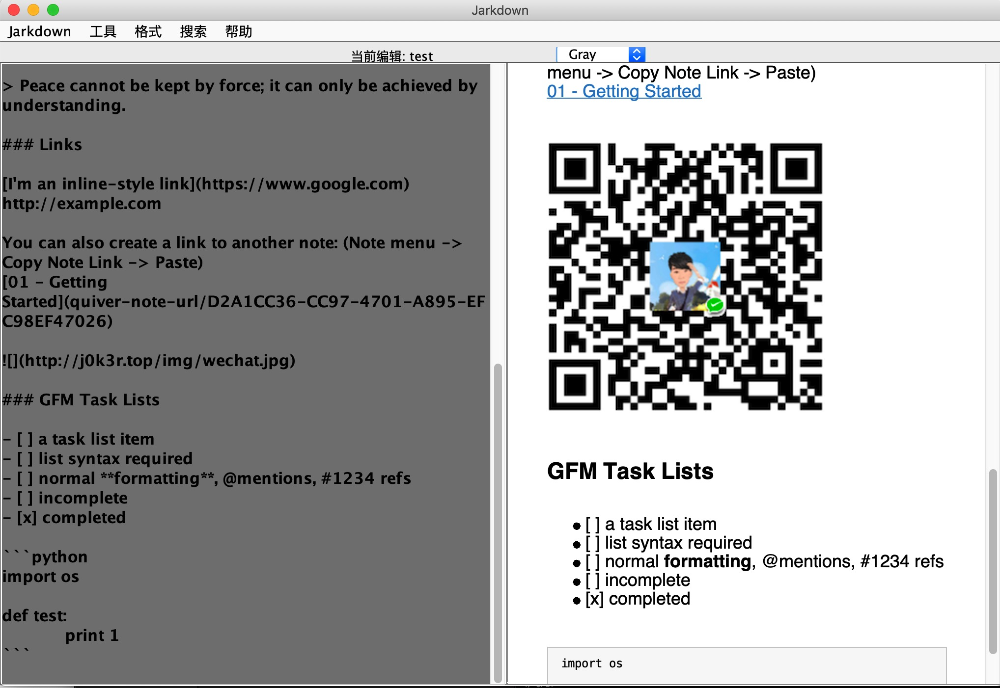

# Jarkdown

一个基于Java的Markdown编辑器（半成品

pom.xml 添加项目依赖包

```xml
<?xml version="1.0" encoding="UTF-8"?>
<project xmlns="http://maven.apache.org/POM/4.0.0"
         xmlns:xsi="http://www.w3.org/2001/XMLSchema-instance"
         xsi:schemaLocation="http://maven.apache.org/POM/4.0.0 http://maven.apache.org/xsd/maven-4.0.0.xsd">
    <modelVersion>4.0.0</modelVersion>

    <groupId>j0k3r</groupId>
    <artifactId>j0k3r</artifactId>
    <version>1.0-SNAPSHOT</version>

    <dependencies>
    <dependency>
        <groupId>com.alibaba</groupId>
        <artifactId>fastjson</artifactId>
        <version>1.2.24</version>
    </dependency>
    </dependencies>

</project><?xml version="1.0" encoding="UTF-8"?>
<project xmlns="http://maven.apache.org/POM/4.0.0"
         xmlns:xsi="http://www.w3.org/2001/XMLSchema-instance"
         xsi:schemaLocation="http://maven.apache.org/POM/4.0.0 http://maven.apache.org/xsd/maven-4.0.0.xsd">
    <modelVersion>4.0.0</modelVersion>

    <groupId>top.j0k3r</groupId>
    <artifactId>Jarkdown</artifactId>
    <version>1.0-SNAPSHOT</version>
    <build>
        <plugins>
            <plugin>
                <groupId>org.apache.maven.plugins</groupId>
                <artifactId>maven-compiler-plugin</artifactId>
                <configuration>
                    <source>6</source>
                    <target>6</target>
                </configuration>
            </plugin>
            <plugin>a
                <groupId>org.apache.maven.plugins</groupId>
                <artifactId>maven-shade-plugin</artifactId>
                <version>1.2.1</version>
                <executions>
                    <execution>
                        <phase>package</phase>
                        <goals>
                            <goal>shade</goal>
                        </goals>
                        <configuration>
                            <transformers>
                                <transformer implementation="org.apache.maven.plugins.shade.resource.ManifestResourceTransformer">
                                    <mainClass>top.j0k3r.Main</mainClass>
                                </transformer>
                            </transformers>
                        </configuration>
                    </execution>
                </executions>
            </plugin>
        </plugins>
    </build>

    <dependencies>
        <dependency>
            <groupId>com.alibaba</groupId>
            <artifactId>fastjson</artifactId>
            <version>1.2.61</version>
        </dependency>
        <dependency>
            <groupId>com.atlassian.commonmark</groupId>
            <artifactId>commonmark</artifactId>
            <version>0.13.1</version>
        </dependency>
        <dependency>
            <groupId>org.jetbrains</groupId>
            <artifactId>annotations-java5</artifactId>
            <version>RELEASE</version>
            <scope>compile</scope>
        </dependency>
        <dependency>
            <groupId>com.atlassian.commonmark</groupId>
            <artifactId>commonmark-ext-gfm-tables</artifactId>
            <version>0.13.1</version>
        </dependency>
    </dependencies>
</project>
```

最终效果



